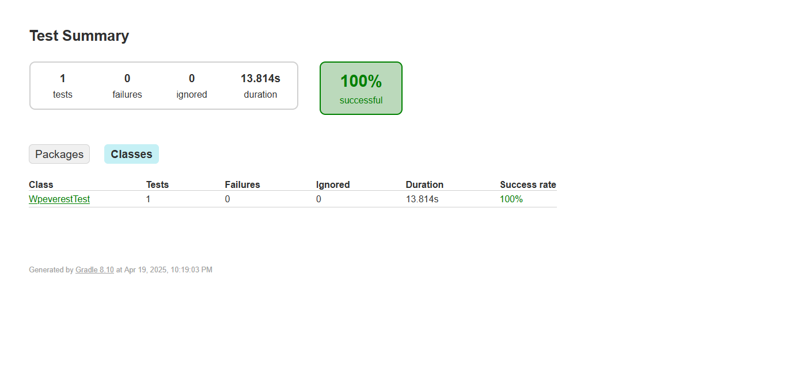
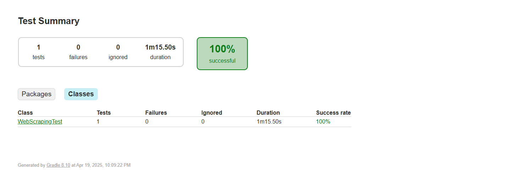

# Web Automation Project using JUnit & Selenium

This project contains automated test scripts for:

1. Webform Automation for Digital Unite
2. Webform Automation for WP Everest Demo
3. Web Scraping from DSE (Dhaka Stock Exchange) Live Share Price Table

---

## ✅ Test Case Descriptions

### 1️⃣ Digital Unite Webform

🔗 **Link**: [Digital Unite Practice Form](https://www.digitalunite.com/practice-webform-learners)

📋 **Steps**:

- Fill out all required fields
- Upload a file (`test.jpg` – under 2MB)
- Submit the form
- Assert: **"Thank you for your submission!"**

🎬 **Demo Video**:

📸 **Report Screenshot**:

---

### 2️⃣ WP Everest Guest Registration

🔗 **Link**: [WP Everest Demo Form](https://demo.wpeverest.com/user-registration/guest-registration-form/)

📋 **Steps**:

- Fill in: Firstname, Lastname, Email, Gender, DOB, Nationality, Phone, Country (Bangladesh), Agree to T&C
- Submit the form
- Assert successful registration

🎬 **Demo Video**:

📸 **Report Screenshot**: 

---

### 3️⃣ DSE Share Price Table Scraping

🔗 **Link**: [DSE Live Share Price Table](https://dsebd.org/latest_share_price_scroll_by_value.php)

📋 **Steps**:

- Scrape all the cell values (excluding floating header)
- Print values in console
- Save them into `ScrapedData.txt`

🎬 **Demo Video**:

📸 **Report Screenshot**: 

---

## 🧪 How to Run

Make sure you have:

- **Java 17**
- **Gradle Wrapper**
- **Installed all required dependencies which are added in ``build.gradle`` file**

To run tests:

```bash
./gradlew test

🧪 Run on Windows

```cmd
gradlew.bat test
```

### 🛡️ .gitignore Setup

To avoid pushing unnecessary files, include the following in your `.gitignore`:

```gitignore
.gradle
.idea
build
gradle
logs
```

### 🧑‍💻 Author

**Faisal Kabir**  
SQA Engineer | Automation Tester | Email: ```onlyfaisalkabir@gmail.com```